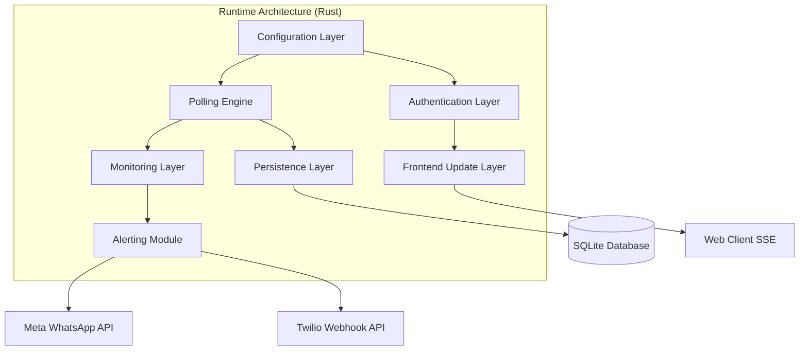

# Component Architecture

This document defines the architectural components, boundaries, and interface boundaries of the Lightweight Stateless Monitoring Engine.

## 1. Component Boundaries
The system is divided into key decoupled components that interact via architectural boundaries:

## 2. Component Responsibilities

### Polling Engine
- **Responsibility:** `[Observed]` Executing scheduled health checking tasks targeting target endpoints.
- **Boundaries:** `[Observed]` Consumes endpoints list from the Configuration Layer. Coordinates target requests using random jitter (±20%) and User-Agent header rotation (`[Observed]`).
- **Execution model:** `[Observed]` Operates up to 50 concurrent active probes (`[Observed]`).

### Alerting Module
- **Responsibility:** `[Observed]` Formatting and dispatching critical notifications on endpoint status changes.
- **Boundaries:** `[Observed]` Triggered by status updates from the Monitoring Layer. Dispatches templates directly via the Meta WhatsApp Cloud API or Twilio webhook calls (`[Observed]`).

### Persistence Layer
- **Responsibility:** `[Observed]` Reading and writing endpoints configuration, failure thresholds, and 30-day historical latency data.
- **Boundaries:** `[Observed]` Interfaces directly with the local SQLite relational store. Performs daily scheduled cleanups of old metrics (`[Observed]`).

### Authentication Layer
- **Responsibility:** `[Observed]` Securing APIs and SSE connections.
- **Boundaries:** `[Observed]` Intercepts all REST API HTTP calls (API Key check) and Web UI updates (Session Cookie check) for the Single Administrator role (`[Observed]`).

### Monitoring Layer
- **Responsibility:** `[Observed]` Calculating consecutive failures, verifying status transitions (Up -> Down), and aggregating p99 latency stats (`[Observed]`).
- **Boundaries:** `[Observed]` Evaluates response results sent by the Polling Engine. Implements the false-positive suppression logic (3 failures threshold) before updating status (`[Observed]`).

### Configuration Layer
- **Responsibility:** `[Observed]` Exposing administration CRUD capabilities for monitored endpoint registers.
- **Boundaries:** `[Observed]` Resolves input requests and propagates configuration changes to the Polling Engine scheduler.

### Frontend Update Layer
- **Responsibility:** `[Observed]` Establishing and maintaining unidirectional Server-Sent Events (SSE) connections to push immediate updates.
- **Boundaries:** `[Observed]` Emits event streams to connected clients within 2 seconds of state transitions (`[Observed]`).

## 3. Component Interactions
- **Polling Loop:** `[Observed]` Polling Engine requests endpoint list -> Iterates with jitter/User-Agent -> Submits response status and latency to Monitoring Layer.
- **Alert Dispatch:** `[Observed]` Monitoring Layer detects 3 consecutive failures -> Updates status to Down -> Commands Alerting Module -> Dispatches to Meta/Twilio.
- **Client Update:** `[Observed]` Monitoring Layer updates database state -> Broadcasts state change to Frontend Update Layer -> Streams update via SSE to Web UI.
