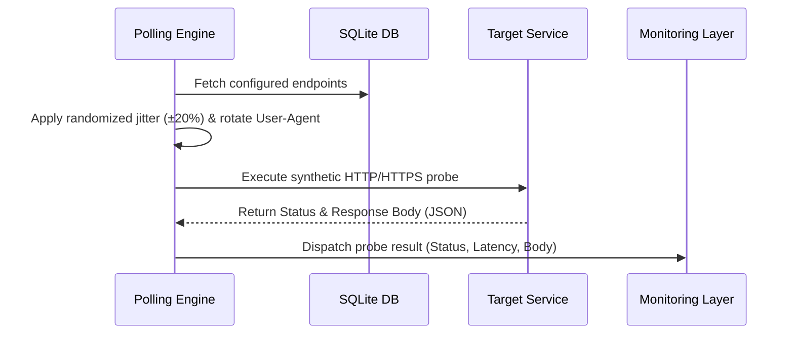
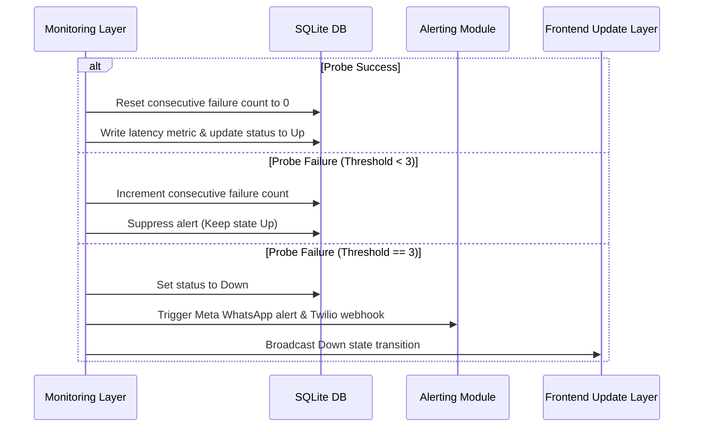

# Data Flow

This document details the operational data flow paths inside the Lightweight Stateless Monitoring Engine runtime environment.

## 1. Health Probe Execution Flow

1. **Scheduling & Jitter:** `[Observed]` The Polling Engine schedules health check workers using randomized jitter (±20% of configuration interval) (`[Observed]`) to distribute network traffic and prevent thundering herd spikes.
2. **User-Agent Spoofing:** `[Observed]` The worker selects a User-Agent header from the configuration pool to bypass web application firewall (WAF) bot policies (`[Observed]`).
3. **Execution:** `[Observed]` A request is dispatched to the target endpoint with a 10-second timeout limit (`[Observed]`).
4. **Ingestion:** `[Observed]` The execution latency and HTTP status/JSON body are sent to the Monitoring Layer for transition analysis (`[Observed]`).

## 2. False-Positive Suppression & Alerting Flow

1. **Success Condition:** `[Observed]` If a probe succeeds (matching HTTP status code / JSON keys), the consecutive failure counter resets to 0 immediately (`[Observed]`). The latency time is logged.
2. **Suppression Phase:** `[Observed]` If the probe fails, the system increments the failure count but suppresses alerting if the count is less than 3 (`[Observed]`). Retries are scheduled at 15-second intervals (`[Observed]`).
3. **Outage Threshold Trigger:** `[Observed]` On the 3rd consecutive failure, the Monitoring Layer writes the status transition (Down) to the persistence store, commands the Alerting Module to send alerts (via Meta WhatsApp and Twilio) (`[Observed]`), and notifies the Frontend Update Layer to stream real-time updates via SSE (`[Observed]`).
