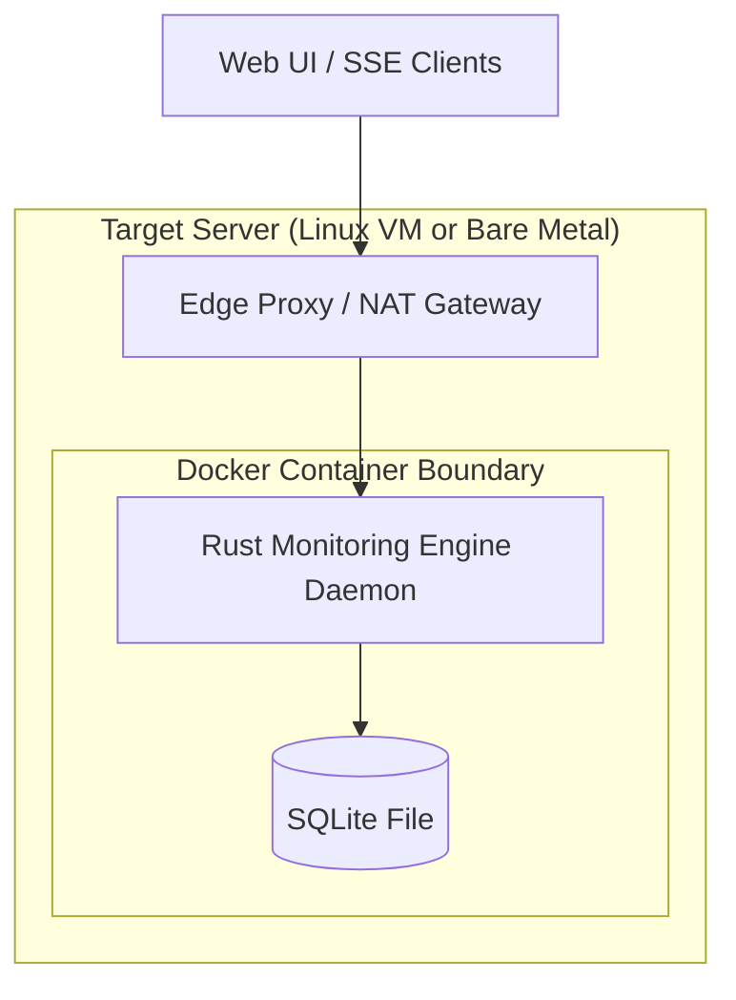

# Deployment Architecture

This document describes the hosting model and physical deployment bounds of the Lightweight Stateless Monitoring Engine.

## 1. Hosting Topology
The system is deployed as a single-instance container or daemon mapping directly to host resources.

## 2. Infrastructure Requirements
- **Hosting Targets:** `[Observed]` Bare Metal Linux Server, Docker Container Host, or Cloud Virtual Machine (`[Observed]`).
- **Orchestration:** `[Observed]` Kubernetes is explicitly out of scope for v1 (`[Observed]`). The deployment model is single-instance (`[Observed]`).
- **Network Boundaries:** `[Observed]` Operates behind edge proxies and strict cloud NAT environments. The application requires outbound HTTPS access (port 443) to target health endpoints, Meta WhatsApp Cloud API, and Twilio APIs. It requires inbound HTTP/HTTPS access for REST APIs, SSE connections, and incoming webhook triggers (`[Observed]`).

## 3. Storage & Packaging
- **Packaging:** `[Observed]` Primary packaging is a Docker Container (`[Observed]`). Supported fallback is a Native Linux Binary (`[Observed]`).
- **Data Volume Mounting:** `[Observed]` The SQLite database file must be located on a persistent storage volume mounted into the container to prevent data loss across container recreation cycles (`[Assumed]`).
