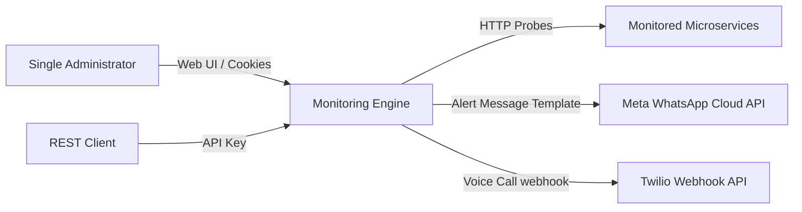

# System Context

This document describes the external actors, client systems, and external service dependencies interacting with the Lightweight Stateless Monitoring Engine.

## 1. Context Diagram

## 2. Actors & Clients

### Single Administrator
- **Description:** `[Observed]` The primary operator of the system.
- **Interactions:** `[Observed]` Uses the Web UI client to perform CRUD actions on target endpoints, view real-time SSE updates, and inspect historical p99 latency stats. Authenticated via session cookies (`[Observed]`).

### REST Client
- **Description:** `[Observed]` Any external automated client or developer tool interacting with the system's management API.
- **Interactions:** `[Observed]` Automates endpoint provisioning and reads latency trends. Authenticated via API key header (`[Observed]`).

## 3. External Dependencies

### Monitored Microservices
- **Description:** `[Observed]` The target microservices endpoints configured for monitoring.
- **Interactions:** `[Observed]` Polled periodically (interval default: 60s, range: 15s to 3600s `[Observed]`). The engine executes synthetic HTTP/HTTPS health checks, validating HTTP status and verifying specific JSON keys (`[Observed]`).

### Meta WhatsApp Cloud API
- **Description:** `[Observed]` The messaging service used to dispatch failure notifications.
- **Interactions:** `[Observed]` Receives templated alert dispatches when an endpoint transitions to the "Down" state after 3 consecutive failures (`[Observed]`).

### Twilio Webhook API
- **Description:** `[Observed]` The telephony integration service used to handle voice call alerts.
- **Interactions:** `[Observed]` Triggered during critical failures to dispatch phone calls to engineering operators (`[Observed]`).
